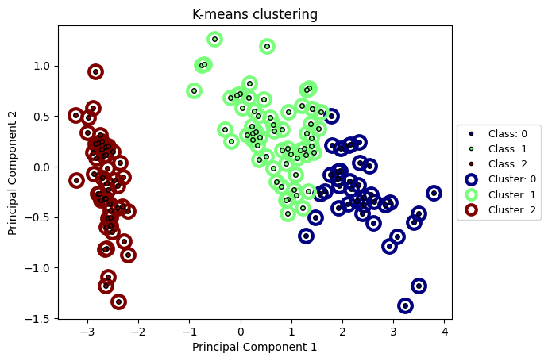

# Learnix
Learnix is a toolbox for implementing different machine learning algorithms including supervised learning and unsupervised learning. This project is inspired by well-known library sklearn. However, this project is developed in a simplified but efficient manner which makes it a friendly toolbox for beginner, new learners, and non-expert users. This toolbox is completely built from scratch, and is still in development. 

**Note**: This project is created for educational purpose only.

## Prerequites
This toolbox is created by only using standard package in Python, i.e numpy. However, there're also several standard packages for dealing with data including pandas, and matplotlib.

Thus, before using this toolbox, it is recommended to install all dependencies by typing this code to terminal:
```
pip install requirements
```

## Algorithms supported
- Supervised learning:
     - Regression:
          - Linear Regression
          - Lasso, Ridge, Elastic Net Regression
          - Polynomial Regression
     - Classification:
          - Logistic Regression
          - Gaussian Naive Bayes
          - K-Nearest Neighbors
          - Support Vector Machines
- Unsupervised learning:
     - K-Means Clustering
     - Mini Batch K Means
     - DB Scan
     - Principal Component Analysis (PCA)

## Example results

### Linear Regression
<p align="center">
    
</p>

### Naive Bayes
<p align="center">
    
</p>

### K-Means Clustering
<p align="center">
    
</p>

For example of how to implement machine learning algorithms in this toolbox, refer to example_usage.ipynb 
